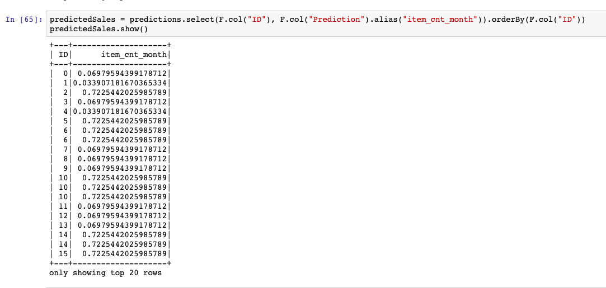
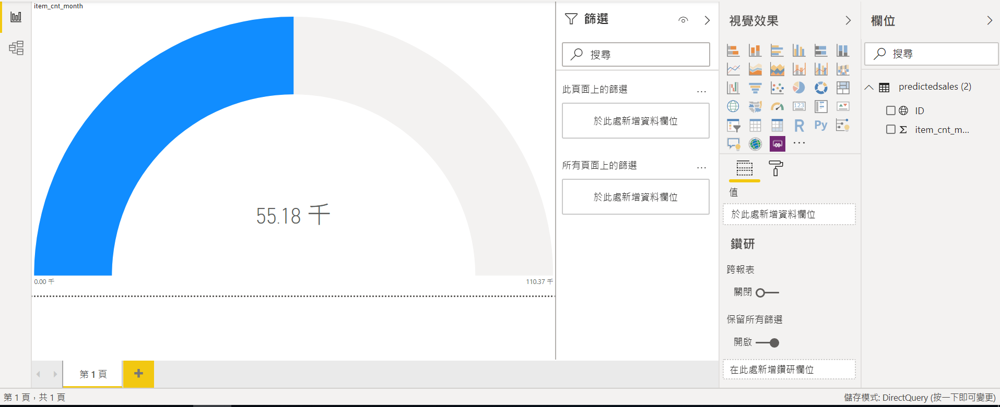

# Retail  sales forecast

## Scenario 

In this Lab  

Part 1:  We  will complete  the process of building and using a  **time-series** analysis  to forecast future sales from historical sales data , and than use of [PySpark](https://spark.apache.org/docs/latest/api/python/index.html) within [Apache Spark in Azure HDInsight](https://docs.microsoft.com/en-us/azure/hdinsight/spark/apache-spark-overview) environment to explore  data, transform the data into meaningful features ,build a **Random Forest Regression** model, and utilize the model to predict  next month’s sales numbers.

Part2 : In this tutorial, you learn how to use Microsoft **Power BI** to visualize data in an Apache Spark cluster in **Azure HDInsight** , make get insights from analyzing data to make business decisions more effective.

## Prerequisite

> To have Microsoft Account or a work or school account

> Install Power BI Desktop(windows OS)

## Create  Blob storage as container

Sign in to the Azure portal ,and in the upper-left corner of Azure portal, select **Storage Accounts**

    

2. Select your **Storage Account**, if you have not **Storage Account**, create new

    

3. Click **Container**

4. Click **add Container**

* Name: **your unique name**
* Public access level : **Container**

5. Click **OK**

## Upload datasets to Blob storage as container

1. Enter  already Created Storage Container

2. Click Upload

3. Upload  datasets to Blob storage from your Computer folder

## Create HDinsight cluster 

1-0. Use the search bar to find **HDinsight cluster**,and click Select.

1-1. In the **HDinsight cluster** workspace pane, select Create to begin.

 

1-2 Inpute and select data
* For Subscripition, Select your Subscripition

* For Resource group , Select your Resource group ,if not have any, Please click Create New

*  For cluster name, type a Unique Name

* For Region , Seclect **East US**

* For Cluster type , Select `Spark`

 

* For Cluster login password , Type a Unique password 

1-3. In the **Storage pane** 

* For Primary Storage type , Select **Azure Storage**

* For Primary Storage account , Select **your storage accounts**

1-4. In the **Configuration + pricing pane**

*  For Work Node , Select `D12 v2(4Cores,28GM) ` 
*  For Node type , modify number of node as `2` 

1-5. Click Create 

## upload code file to  Payspark  development enviroment

Wate for about 45min - 1hr , Service build complete .

1. On Cluster dashboards , Select **Jupyter notebook**

    

2. Inpute informations
* UserName: `admin`
* Passwords: you set passwords 

    

3. Upload `retail-sales-forecast.ipynb` , and then click upload 

    

4. Click **file**

    

## Data analysis and build model 

Detail train processing from [Model Train Processing](model/README.md)

### Prediction of Future Sales

1. Sorting the results by the ID and then removing all of the features to leave us with an ID and a predicted sales count

    

### Run queries on the dataframe

1. Once the table is created, you can run an interactive query on the data.

    

## Data Visualize by Power BI

1. Open Power BI Desktop

2. From the Home tab, navigate to Get Data > More...

    

3. Enter Spark in the search box, select Azure HDInsight Spark, and then select Connect.

    

4. Enter your cluster URL  in the Server text box 

    

5. Under Data connectivity mode, select DirectQuery. Then select OK

    

6. Enter the HDInsight login account information, then select Connect. The default account name is `admin`.

7. Select the `predictedSales` table, wait to see a preview of the data, and then select Load.

    

8. Sales distributed with **ID** and  **Price**

* Convert to a line chart by selecting the line chart template from the Visualizations pane.

    

    

9. Sales count 

* Convert to a line chart by selecting the line chart template from the Visualizations pane

    

    
    
    

10. Train sales distributed with **Item_ID** and  **Itemn_Price**

    

    

##  Conclusion

Congratulations! You now have learned how to:

1. Create Blob storage as container

2. Upload datasets to cloud storage

3. Create HDinsight cluster 

5. Use Spark API to train and predict model

6. Use  SQL language query dataframe

7. Make result value  to visualize  by Power BI

## Clean up Resource

In the resource group,Delete resource

1. HDinsight cluster

2. Azure Storage

