# Data analysis and build model 

Build best model, and utilize the model to predict  next month’s sales numbers

 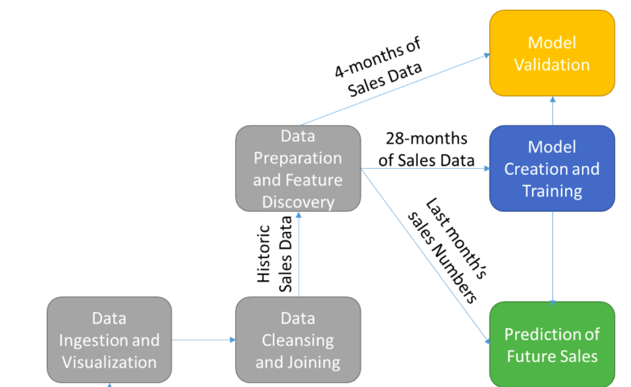

##  Ingestion Of Historic Sales Data

 We first need to access and ingest the data from its location in an Blob storage data store and put it into a PySpark DataFrame

 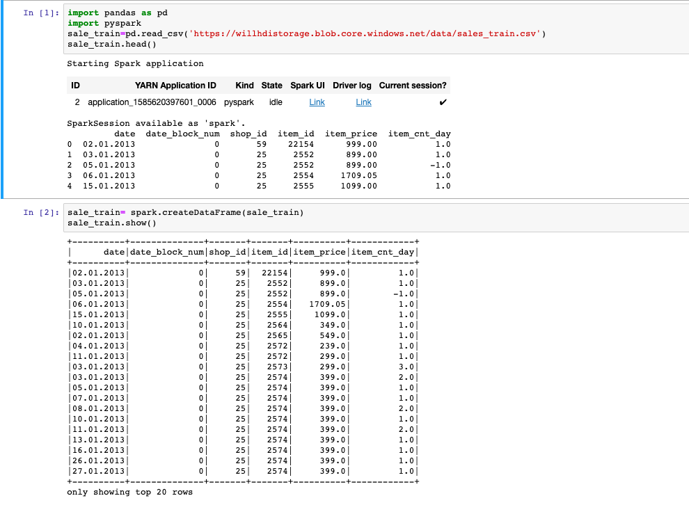

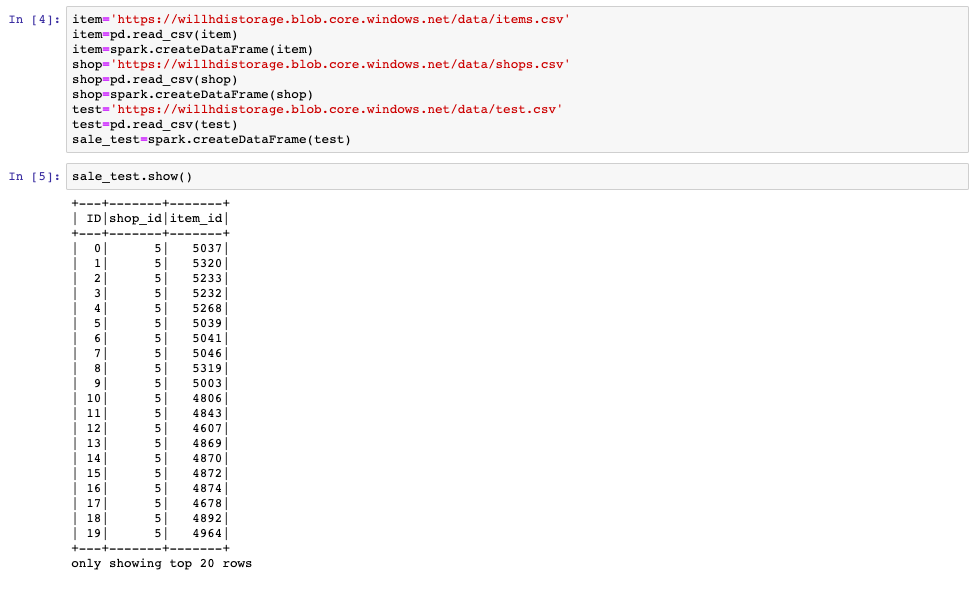

##  Data Cleanup And Table Joining To Create Single Feature Vectors 

We then to combine the information from the **sales**, **category**, **item**, and **shop** files into a single data frame

 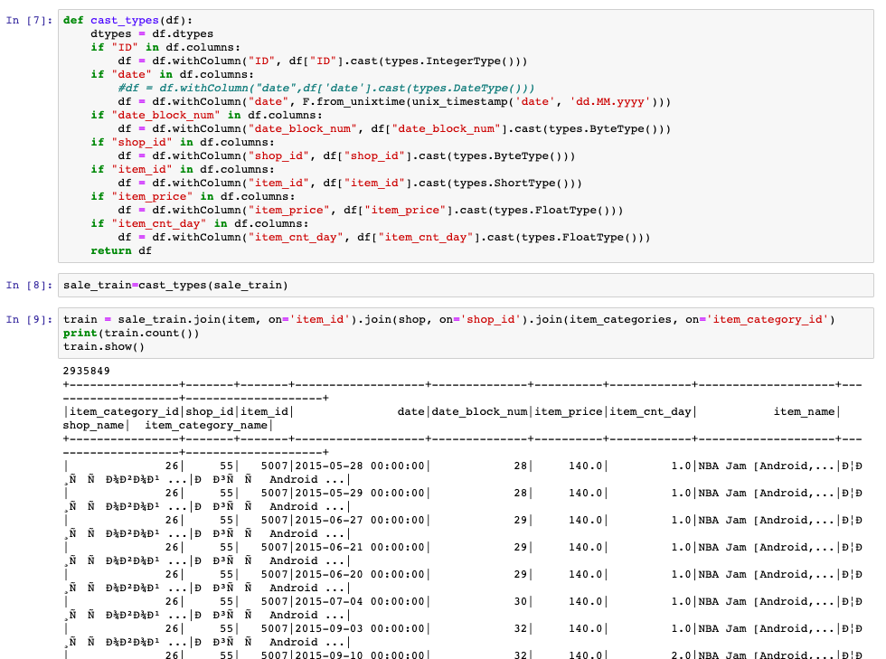

1-1. Remove items that are no longer being sold and shops that are no longer open

 We then filter based on the list of unique item and shop IDs in the test data frame

 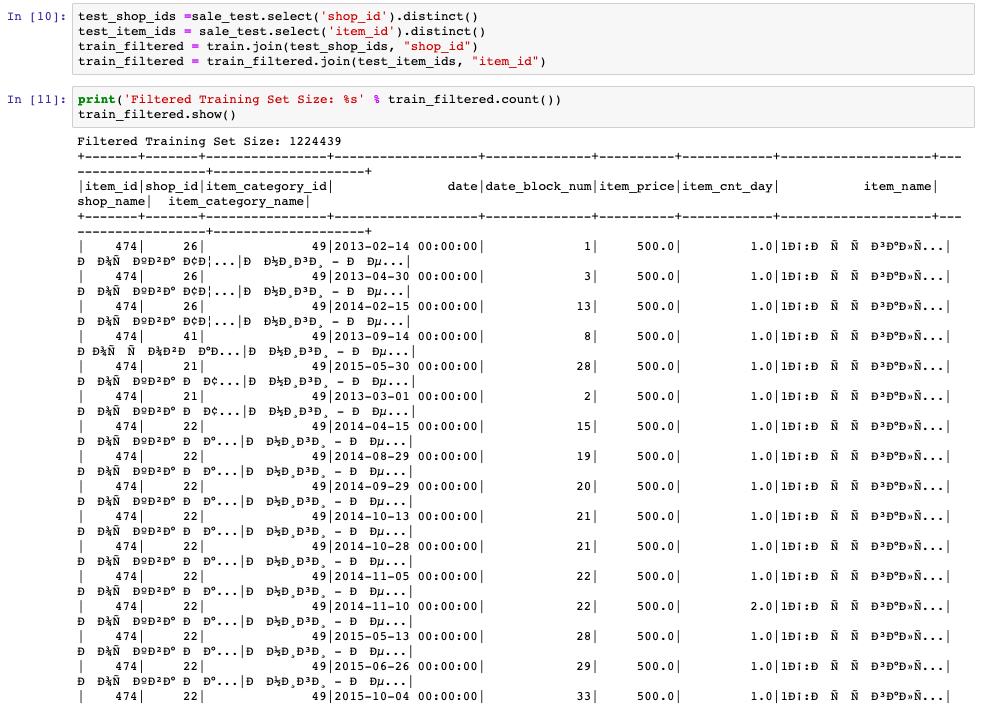

##  Data Preparation Including Feature Discovery

We  prepare the data for use in training our model

1-1.  Calculate the average values for each item’s price and sales counts

we will be to calculate the average values for each item’s price and sales counts, the total cost and item count of each item transaction, and the total number of transactions including each unique item

 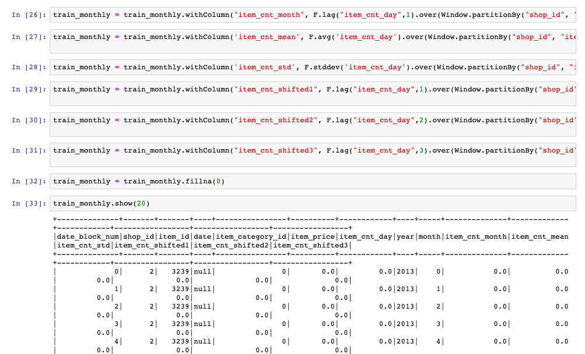

1-2.  Set these to the appropriate average values based on the item averages we just calculated

  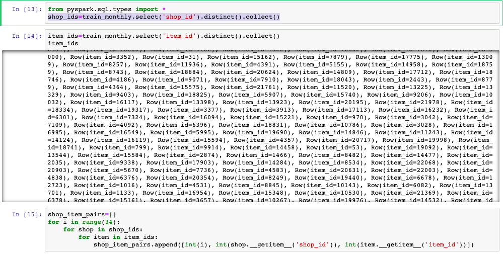

  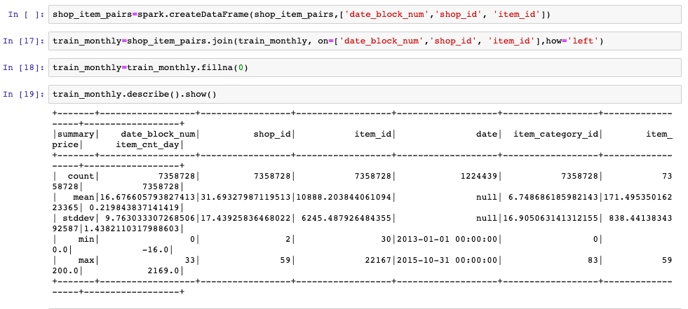

##  Filter outliers

For outliers, we determined that anything with a negative item count or an item count above **20** and anything with a price above **400,000** is an outlier.

  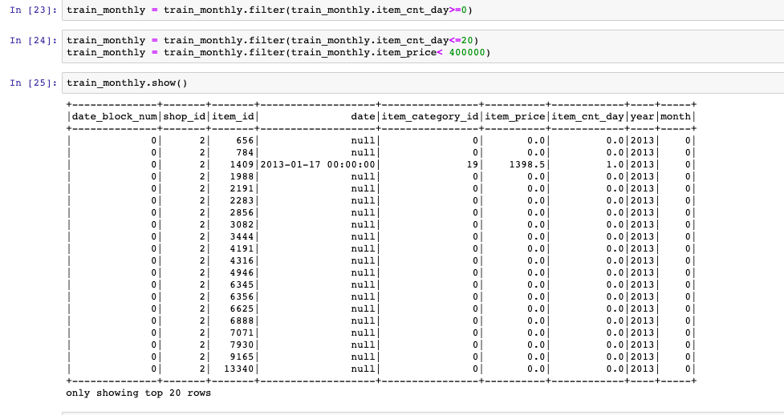

## Spilt Train datasets , validation datasets and test datasets

we split the data into a training set, validation set, and test set. To do this, we select the first **28** months as our training set while skipping months 1 and 2 as they will not have the required prior month data. We select the **29-32** months as our validation set and month **33** as our test set

  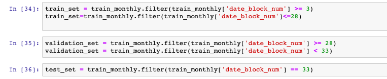

We then downselect the feature list to those that we want to use to train the model. These include the shop ID, the item ID, the monthly item count, the transaction count, the year, the average and standard deviation of the item count, and the previous month’s item count

  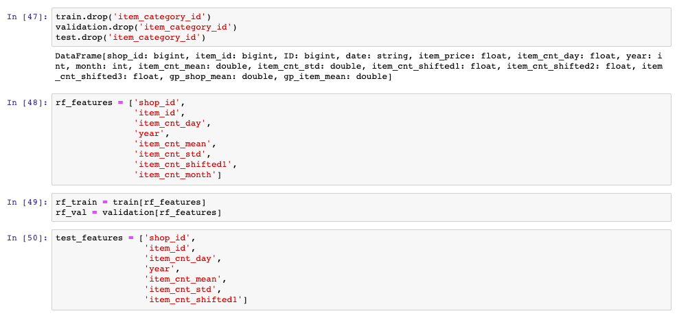

##  Model Creation And Training

we are now ready to create and train the **Random Forest Regression** model to allow us to predict the **next month’s sales** numbers

And to assemble all of the training features in a single VectorAssembler object. This step requires passing in the feature names that you want to train the model on and an output column name

  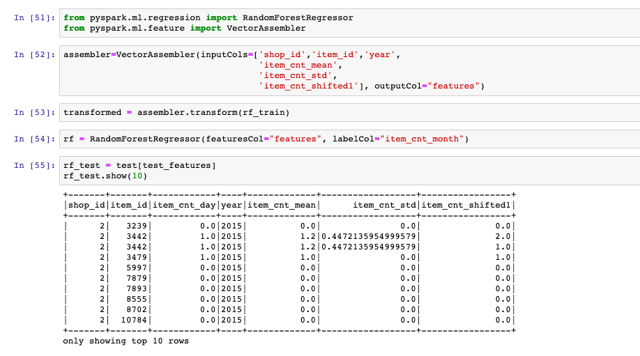

  We now train the model by calling the `fit` function with the transformed training data

  And display the learned feature importance. The **higher** the feature importance, the more influence and impact it has on the predicted sales volume

  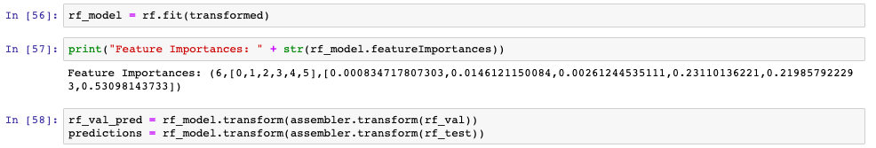

##  Prediction of Future Sales

we join the test predictions with the initial ID included in the test.csv file based on the unique **item_id** and **shop_id** pair. We then display the predictions for review

  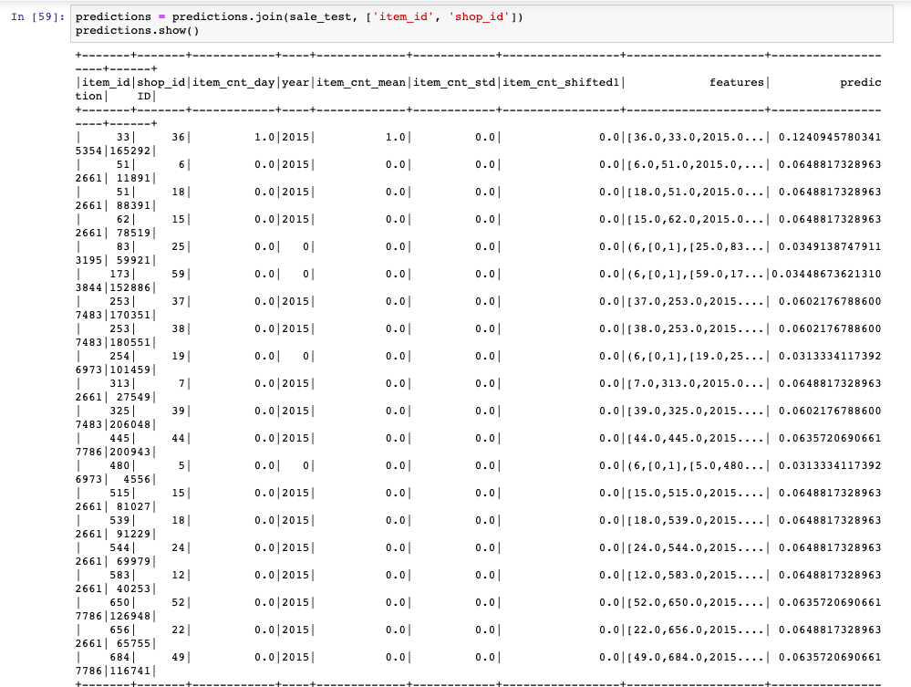

## Model Vaildation 

we calculate and the root mean square error(RMSE) of the predictions

  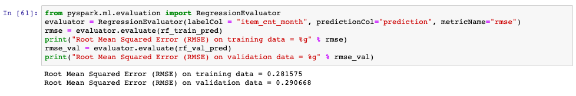

##  Simplify the results

Sorting the results by the ID and then removing all of the features to leave us with an ID and a predicted sales count

  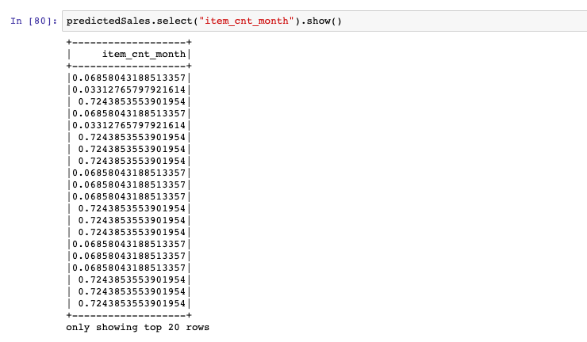

